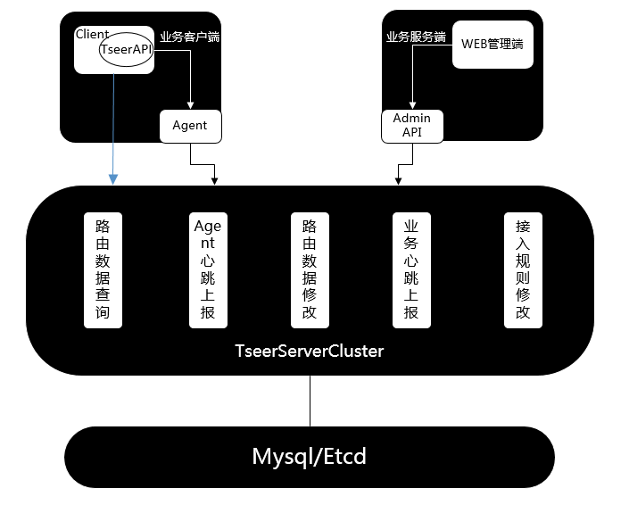
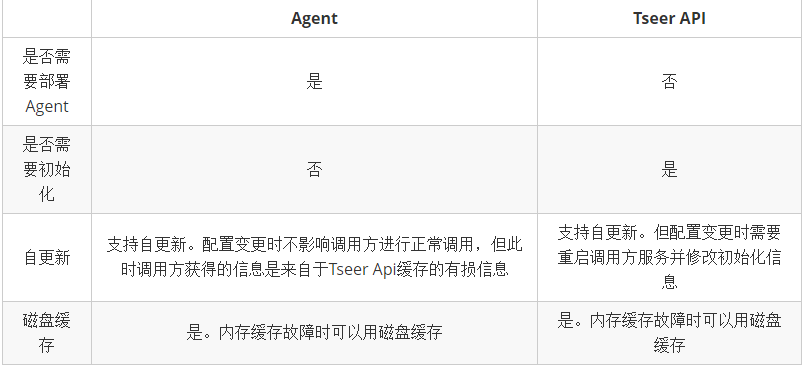

# Product Description of TSeer

# Contents
> * [1.Introduction of Tseer](#ch-1)
> * [2.Research Background](#ch-2)
> * [3.Architecture of Tseer](#ch-3)
> * [4.Functional Characteristics of Tseer](#ch-4)

## 1. Introduction of Tseer

Tseer is a high-performance tool to solve service discovery between multi-frame service clusters, which routes by name and is simple to use. TSeer is widely used in Tencent, which with a daily average of billions of requests.

In addition to the core features of service discovery, Tseer also supports a variety of excellent load balancing algorithms and provide reliable fault tolerant strategies. For the rapid development of massive services, Tseer supports three different routing strategies: nearest access, logical grouping by SET, and full scheduling. Through TSeer, the engineering services can achieve highly intelligent scheduling optimization, effectively solve the cross-regional cross-area room calls and other issues, greatly promoted the availability and performance.

Users can freely choose web management interface or API access to use TSeer according to their needs. TSeer provides transparent service discovery through proxy nodes and proxy server mechanisms for services that require frequent changes. TSeer's learning cost is very low and its operation is very convenient. Therefore, it is very friendly to Business operations staff.

Compared with other service discovery tool, TSeer is lightweight and has low business intrusiveness because of working in bypass mode. Whether it is dealing with new business or old business, TSeer is very suitable and extremely friendly. TSeer is an excellent name service solution in the microservices framework.

## 2. Research Background

Monolithic architecture services are rarely released for change, and the network location of the service is rarely changed. Operation and maintenance personnel handle occasional service changes by manually changing the configuration. Now that a system has a large number of services, the monolithic architecture design idea has been unable to efficiently and steadily support the business growth. Distributed service clusters and microservice frameworks have gradually become mainstream.

However, while the new architecture provides better support for services, services are frequently updated and scaled, resulting in frequent changes in the network location of services. In this case, the O&M personnel manually change the configuration not only increases the risk of errors, but also limits the rapid development of the business. Often, the O&M personnel have not changed the configuration and new changes will need to be released. To sum up, there must be an automated service discovery tool to solve these problems. 

In addition to the above issues, on the premise that services are successfully accessed, service response time, as the most important indicator of service quality, is the most critical aspect affecting business development. The complex call relationships between multiple service sets and other factors such as cross-regional cross-network calls, resulting in long service response times, are major issues that limit the overall business development. At the same time, whether the use of physical machines or virtual machines, the service caused by the downtime can not be available from time to time, so fault tolerance is an issue that needs to be solved.

We have developed Tseer to solve these problems.

## 3. Architecture of Tseer

TSeer's structure is divided into three parts: TSeerServer, Business Client(caller), Business Server(callee).

* TSeerServer

    TSeerServer is the hub and core module of the entire TSeer. 
    When a new node goes online, the O&M personnel need to first register the node with the TSeerServer cluster through the WEB management platform and record its network location information in the TSeerServer system. When the node needs to be offline or modified, the O&M personnel also need to perform related operations on the WEB management platform. Callee will periodically report the heartbeat to Tseerserver. Tseerserver will block the heartbeat timeout node so that it cannot be called.

* Business Client

    A business client is a node that needs to invoke other services. It is called caller and is a user of the service discovery function.
    The business client can obtain the address of the service node to be invoked from the TSeerServer in two ways by installing the Agent and the API call, thereby completing the service call.

* Business Server

    A business server is a node that needs to be called. It is called callee and is a provider of the service.
    When the new node of business server goes online, the callee needs to be registered with TSeerServer. Regardless of the number of nodes in the same callee service cluster, the service cluster needs to register a unified name when registering. The caller in the calling logic only needs to specify the name of the service that needs to be invoked. TSeer will return the callee's address based on the name. When the callee's server cluster needs to expand, the O&M personnel only needs to add the new node's address under the name corresponding to the service. The business personnel does not need to manage the information of numerous service nodes in the callee cluster, so the use of TSeer is very convenient

## 4. Functional Characteristics of Tseer

### 1.Load balancing

When some nodes are frequently called in the same service cluster, and some other nodes do not bear a reasonable load, the service quality and response time of the service will be greatly reduced, and resources will also be wasted.

In the Tseer system, when the caller initiates a call, TSeer provides caller with four load balancing methods for all available nodes under the callee's name to ensure that each node of the callee cluster bears a reasonable load. Here are:

* Round Robin
* Random
* Static Weight
* Consistent hash

The user can also customize the load balancing implementation by invoking the grouping method. The manner of invoking the grouping will be mentioned below.

### 2.Fault Tolerant

In order to solve the problem of service unavailability and service quality degradation caused by node downtime, TSeer also provides a reliable fault tolerance mechanism.

After the caller makes a call, the result of the call is reported to TSeer Server. If the call fails, TSeer Server temporarily masks the callee's node to prevent the faulty node from being called repeatedly. The TSeer Server will periodically probe the blocked callee's node. When the faulty callee's node recovers the service, The TSeer Server will activate it again.

> For any callee's node, the node is blocked when one of the following conditions is met:
> 
> 1. The number of call failures reaches twice in one detection cycle (60 seconds), and the number of call errors exceeds 50% of the total number of calls.
>
> 2. Consecutive calls failed more than 5 times in 5 seconds.

TSeer Agent/Api will retry masked nodes every 30 seconds.

When TSeer Server fails, callers can continue to call based on the cached information.

### 3.Call optimization

TSeer provides IDC grouping, Set grouping, and All three ways to resolve cross-regional calls for the calling logic.

* All

  Provide callers with all available callee's node addresses.

* IDC Grouping

  The IDC grouping routing can be viewed approximately as a nearby access.

This method is divided into two levels. The first level is the physical group, which is the smallest group scheduling unit. The physical group is assigned a unified identification name according to the room or area where the node is located. The second level is the logical group made up of physical groups, which can assign a unified identification name to a larger area.

For the logical grouping of IDC, TSeer also defines a call priority policy, that is, when some logical groups are unavailable, a list of available callee's node addresses is obtained according to the priority policy.

* Set Grouping

IDC Grouping mainly divides the groupings in the concept of the area and implements the nearest access strategy. When the service size in the back-end service architecture reaches a certain number, if it is required to implement isolation control based on capacity, grayscale, and partition management for certain service nodes, the IDC Grouping cannot be satisfied. However, Set Grouping is a refinement of IDC Grouping.

The naming rules for a Set Grouping are: **Set Name.Set Region.Set Group**. Among them, the **Set group** is the smallest distinguishing unit and supports the wildcard character *, indicating all the groups under the Set Region. For example, 0,1,2,3,4 or a,b,c,d.

The invocation logic of Set Grouping is as follows:

1.The caller (client) and callee (server) are enabled for the Set Grouping, and the Set Name must be consistent to be considered enabled within the same SET.

2.Caller and callee with Set Grouping routing policy enabled can only access nodes within the same SET

3.Caller enables Set Grouping, but callee does not enable Set Grouping, then the entire business defaults to the routing logic of IDC Grouping (if IDC Grouping is enabled)

### 4.Two access types

TSeer's usage can be divided into Agent and TSeer API, depending on whether the client deploys TSeer Agent in its physical machine:

- Agent Type

**Name Routing**

In the Agent type, the TSeer Agent periodically caches the information of the callee and returns the callee information to the caller according to the load balancing policy. If the caller wishes to achieve load balancing through service features, TSeer also supports returning callee information to the caller according to the caller's specified grouping strategy.

**Data Reporting**

After each call is completed, the caller needs to invoke the report interface provided by the TSeer API to report the call information. The call information will be immediately reported by the TSeer API to the Tseer Agent. The Tseer Agent will remove the invalidated callee node based on the call information.

**Fault Tolerant**
When using the Agent mode, if the TSeer Agent fails, the TSeer API will return the visited callee node from the memory to the caller. If the cache fails, the TSeer API will restore the cached information from the local disk to the caller. It should be noted that, at this time, the Callee node information provided by TSeer Api to the caller is lossy information, and TSeer Api does not guarantee that the callee node must be alive.

- TSeer API Type

**Name Routing**

The difference between the Agent type and TSeer Api type is whether the TSeer Agent needs to be deployed in the physical host of the caller. With TSeer Api, client will access TSeer Server directly without passing TSerer Agent. And callee information caching, load balancing, and invalid node culling are done through the TSeer API.

TSeer Api periodically pulls TSeer Server's feedback and masks unavailable callee nodes.

**Fault Tolerant**

When the TSeer Server fails, the TSeer API will return the visited callee node from the memory to the caller. If the cache fails, the TSeer API will restore the cached information from the local disk to the caller.

**Agent Api Type vs. TSeer Api Type**

