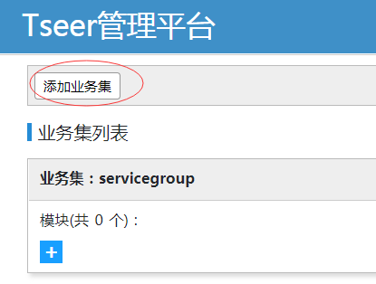
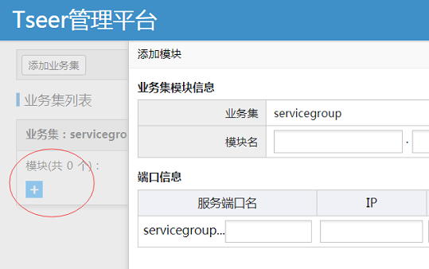
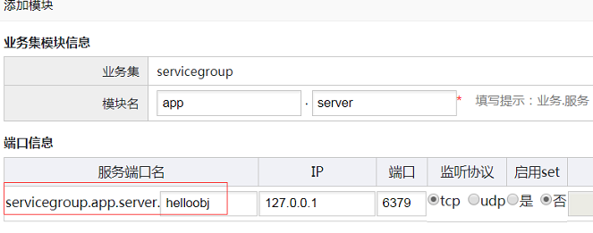

# tseer 安装指引

## 依赖环境

软件 |软件要求
------|--------
linux内核版本:      |	2.6.18及以上版本（操作系统依赖）
gcc版本:          	|   4.1.2及以上版本、glibc-devel（c++语言框架依赖,源码编译依赖）
bison工具版本:      |	2.5及以上版本（c++语言框架依赖,源码编译依赖）
flex工具版本:       |	2.5及以上版本（c++语言框架依赖,源码编译依赖）
cmake版本：       	|   2.8.8及以上版本（c++语言框架依赖,源码编译依赖）
resin版本：       	|   4.0.49及以上版本（web管理系统依赖,源码编译依赖）
Java JDK版本：      | 	web管理系统（最低1.8）
Maven版本：			|   2.2.1及以上版本（web管理系统、java语言框架依赖）
rapidjson版本:      |   1.0.2版本（c++语言框架依赖,源码编译依赖）

运行服务器要求：1台普通安装linux系统的机器即可。

## 0. 安装依赖Tars
   从[github](https://github.com/Tencent/Tars)下载Tars源码.
   进入cpp/build目录下，执行./build.sh all; ./build.sh install即可
   并不需要安装部署tars的框架服务，比如tarsnode等等，所以安装还是比较简单快速。

## 1. 安装方式选择

Tseer和其他优秀开源软件一样，我们提供二进制安装方式和源码编译方式。二进制安装方便快速部署，源码安装可定制性强。

#### 二进制安装

需要预先安装python，确保机器网络正常.

#### 源码安装

需要预先安装python, gcc, cmake，确保机器网络正常，能够git克隆github的仓库.

## 2. 二进制安装

#### 下载二进制安装包 tseer-1.0.0.tar.gz

1. 解压文件: tar xf tseer-1.0.0.tar.gz 
2. 编辑解压目录下的配置文件：vim build/tseer_deploy.ini;配置文件详情第4节介绍（主要修改base_dir，其它用默认值就可以了）
3. 到etcd官方网站下载etcd二进制安装包,包名是etcd-v3.2.5-linux-amd64.tar.gz,[点此立即下载](https://github.com/coreos/etcd/releases/download/v3.2.5/etcd-v3.2.5-linux-amd64.tar.gz),并放到build/etcd目录下
4. 到resin官网下载resin二进制安装包，包名是resin-4.0.49.tar.gz,[点此立即下载](http://www.caucho.com/download/resin-4.0.49.tar.gz),并放到build/webadmin目录下
5. 执行安装：cd build; python tseer_deploy.py
6. 安装完成之后可以参考章节五进行tseer产品的体验了！！

## 3. 源码安装

#### 注意

- 安装一定要`cd build/`执行安装脚本
- 安装目录和源码目录不要重叠。

### 下载源码

使用git下载：git clone https://github.com/Tencent/TSeer.git

1. 编辑配置文件: vim build/tseer_deploy.ini,修改install_type=source,使用源码安装方式（详细用法请参考章节4,编辑好之后再执行第二步）
2. 执行安装：cd build; python tseer_deploy.py


## 4. 编辑安装配置

安装配置文件的位置： tseer/build/tseer_deploy.ini

### 4.1 tseer基础配置：

```ini
[tseer]
; install_type: bin, source; default: bin.
; binary install: place binary executable to your set base path
; source install: depend tars
install_type=bin
; storage: etcd, mysql. data storage.
storage=etcd
base_dir=/usr/local/
bind_ip=localhost
```

- install_type 安装方式：  源码安装选择source，将会进行编译安装； 二进制安装则直接使用git上已经编译好的binary包安装。
- base_dir 安装路径：服务将安装你指定目录下的tseer目录。
- bind_ip TseerServer/TseerAgent监听地址：默认是本机的IP。

### 4.2 tseerServer配置：

```ini
[tseer_server]
; agent registry and report heartbeat
regport=9002
; query service ip and port
queryport=9903
; admin port
apiport=9904
```

- regport: tseerAgent注册、上报心跳到tseerserver的端口，以及web上传agent发布包的端口
- queryport：服务路由信息查询端口
- apiport：管理平台web增删改查路由数据和管理tseeragent的端口

### 4.3 存储介质配置


#### 4.3.1 Etcd配置
如果你选择etcd作为存储介质，脚本将自动安装配置

```ini
[etcd]
; host_list: localhost or like 10.0.0.1,192.168.0.10, 172.168.10.1
; localhost: start local 3 etcd instance
;host_list=localhost
client_port=2379
cluster_port=2380
base_dir=/data/test/etcd/
```

- host_list:  部署etcd的主机列表，默认启动三个etcd实例。远程安装依赖paramiko库，请自行安装。
- client_port: 访问的接口
- cluster_port: etcd集群内部通信端口

其中etcd member名字默认是`tseer_etcd`加上序号，不可配置


## 5. 部署web平台

一键安装脚本中并不包括web平台的部署,需手动操作,这里补充如下:


从[这里](http://caucho.com/download/resin-4.0.49.tar.gz)下载resin安装包。
将resin包解压在build/webadmin目录下

```
cd build/webadmin
tar xvf resin-4.0.49.tar.gz
```

生成我们的war包,执行下面命令后，可以在target目录下看到`seer-1.0.0-SNAPSHOT.war`文件,
将其拷贝到resin的webapps目录下

```
cd web  # 源码web目录下有pom.xml文件
mvn clean
mvn install
```

启动resin
在resin目录下，执行

```
./bin/resin.sh stop
./bin/resin.sh start
```

注意，可能需要修改war包中配置的TSeer服务地址，修改方法如下

```
cd resin # 进入到resin目录下
vim webapps/seer-1.0.0-SNAPSHOT/WEB-INF/classes/system.properties
```

将seer.api.url和seer.agent.onekey.install.url的值修改成你部署的TseerServer监听ip及4.2节配置的apiport
最后重启resin即可


## 6. 开始体验tseer

### 6.1 访问管理平台

resin默认端口是8080，所以在你的浏览器输入 http://127.0.0.1:8080即可（ip替换成真实绑定的ip）


### 6.2 添加路由数据

- 在页面右上角，点击`业务集列表`


- 进入后点击`添加业务集`，输入业务集名称



- 添加模块



- 添加具体路由对象

 tseer的路由名称是四段式的：业务集.业务名.服务名.端口名，添加业务集时已经确认了业务集名字，
 在添加模块时候，还需要填写剩下的三段名字。如图所示，填写的业务名是app，服务名是server，端口名是helloobj




### 6.3 使用API获取路由数据

tseer提供C++、JavaAPI， 路径放在预设安装路径下的api目录下

如何使用，请查看相应API使用教程和实例。

例1：执行默认测试程序
- 到api/cplus 目录下执行 cmake .;make;make tar
- 在test目录得到testapi测试工具，在当前目录下执行./testapi 默认就可以测试上面安装结果是否成功
- 默认测试结果如下：
```
[root@xxxx ~/tseer/api/cplus/test]$ ./testapi 
obj:Tseer.TseerServer.RegistryObj
type:0
lbtype:0
set:
pureApi:false
dns:localhost
cnt:5
thread nu:1
30317|ip:127.0.0.1|port:9902|tcp:true|ret:0|
```
